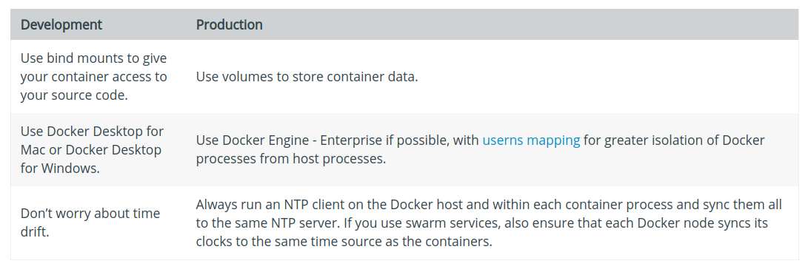

# [译]Docker开发最佳实践

原文地址：[Docker development best practices](https://docs.docker.com/develop/dev-best-practices/)

下面的开发模式已经被证明有助于人们使用`Docker`构建应用程序。如果你发现了我们应该补充的东西，[请告诉我们](https://github.com/docker/docker.github.io/issues/new)

## How to keep your images small

启动容器或服务时，小镜像在网络上传输更快，在内存中加载更快。有一些经验法则可以使镜像保持较小尺寸：

* 从一个合适的基础镜像开始。例如，如果您需要一个`jdk`，可以考虑基于官方的`openjdk`镜像，而不是用通用的`ubuntu`镜像，再安装`openjdk`
* [Use multistage builds](https://docs.docker.com/engine/userguide/eng-image/multistage-build/)。例如，您可以使用`maven`镜像来构建Java应用程序，然后重置为`tomcat`镜像，并将`Java`工件复制到部署应用程序的正确位置，所有这些都在同一个`Dockerfile`中。这意味着您的最终镜像不包括构建所拉入的所有库和依赖项，而只包括运行它们所需的工件和环境
    * 如果需要使用不包含多级构建功能（`multistage build`）的`Docker`版本，请尝试通过最小化`Dockerfile`中`RUN`命令的数量来减少镜像层数。您可以通过将多个命令合并到一个`RUN`中，并使用`shell`的机制将它们组合在一起来实现。考虑以下两个片段。第一个在镜像中创建两个层，而第二个只创建一个层
        ```
        RUN apt-get -y update
        RUN apt-get install -y python
        ```

        ```
        RUN apt-get -y update && apt-get install -y python
        ```
    * 如果您有多个具有许多共同点的镜像，请考虑使用共享组件创建自己的[基础镜像](https://docs.docker.com/engine/userguide/eng-image/baseimages/)。`Docker`只需要加载一次公共层即可（因为它们在本地缓存了）。这意味着您的后续镜像可以更高效地使用`Docker`主机上的内存并更快地加载
    * 要使生产镜像保持精简但允许调试，请考虑使用生产镜像作为调试镜像的基础镜像。可以在生产镜像的顶部添加额外的测试或调试工具
    * 在构建镜像时，请始终使用有用的标记对其进行标记，这些标记用于编码版本信息、预期目标（例如`prod`或`test`）、稳定性或在不同环境中部署应用程序时有用的其他信息。不要依赖于自动创建的`latest`标记

## Where and how to persist application data

* 避免使用存储驱动程序（[storage drivers](https://docs.docker.com/engine/userguide/storagedriver/)）将应用程序数据存储在容器的可写层中。这会增加容器的大小，从`I/O`的角度来看，这比使用卷（`volume`）或绑定装载（`bind mount`）效率低
* 使用卷（[volume](https://docs.docker.com/engine/admin/volumes/volumes/)）存储数据
* 在开发过程中，可能需要挂载源目录或刚刚构建到容器中的二进制文件，这时使用绑定挂载（[bind mounts](https://docs.docker.com/engine/admin/volumes/bind-mounts/)）是合适的。对于生产环境，请改用卷（`volume`），将其挂载到与开发过程中进行绑定挂载相同的位置
* 在生产环境中，使用[secrets](https://docs.docker.com/engine/swarm/secrets/)存储服务使用的敏感应用程序数据，并对非敏感数据（如配置文件）使用[configs](https://docs.docker.com/engine/swarm/configs/)。如果您当前使用独立容器，请考虑迁移到使用单个副本服务，以便您可以利用这些仅限服务的功能

## Use swarm services when possible

* 尽可能的使用`swarm`服务设计应用程序
* 即使只需要运行应用程序的单个实例，`swarm`服务也比独立容器提供了一些优势。服务的配置是声明性的，`Docker`总是保持所需的和实际的状态同步
* 网络和卷可以与`swarm`服务连接和断开，docker以非干扰（`non-disruptive`）的方式处理单个服务容器的重新部署。而独立容器需要手动停止、删除和重新创建以适应配置更改
* 一些特性，例如存储[secrets](https://docs.docker.com/engine/swarm/secrets/)和[configs](https://docs.docker.com/engine/swarm/configs/)的能力，只针对服务而不是独立容器可用。这些特性允许您尽可能地保持镜像通用性，并避免在`Docker`镜像或容器本身中存储敏感数据
* 使用`docker stack deploy`处理任何镜像拉取，而不是使用`docker pull`。这样，部署就不会试图从已关闭的节点中拉取。此外，当新的节点被添加到`swarm`中时，镜像会被自动提取

在`swarm`服务的节点之间共享数据有一些限制。如果你使用[Docker for AWS](https://docs.docker.com/docker-for-aws/persistent-data-volumes/)或[Docker for Azure](https://docs.docker.com/docker-for-azure/persistent-data-volumes/)，你可以使用`Cloudstor`插件在`swarm`服务节点之间共享数据。您还可以将应用程序数据写入支持同步更新的单独数据库

## Use CI/CD for testing and deployment

* 当对源代码控制进行更改或创建拉取请求时，请使用[Docker Hub](https://docs.docker.com/docker-hub/builds/automated-build/)或其他`CI/CD`管道自动进行生成，标记`Docker`镜像并对其进行测试
* 在[Docker Engine-Enterprise](https://docs.docker.com/ee/)中更进一步，它要求您的开发、测试和安全团队在镜像部署到生产环境之前对其进行签名。这样就可以确保在将镜像部署到生产环境中之前，它已经过了测试，并得到了开发、质量和安全团队的批准

## Differences in development and production environments

