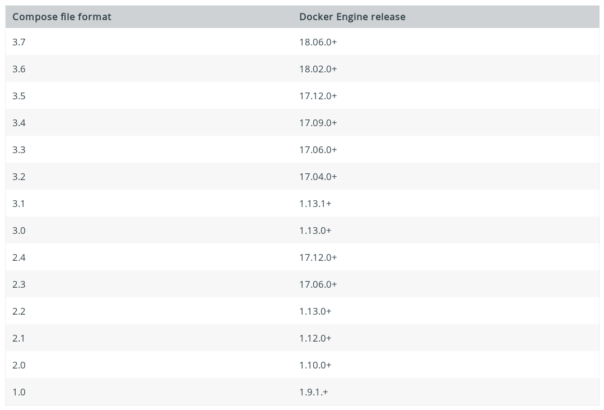

# Compose版本依赖

参考：[Compose and Docker compatibility matrix](https://docs.docker.com/compose/compose-file/#compose-and-docker-compatibility-matrix)

`Docker Compose`分为两个部分：文件格式与应用版本

## 文件格式

`Docker Compose`经历了多次的文件格式调整，不断增加新的内容。其文件格式与`Docker`引擎版本对应如下：



当前使用的`Compose`文件格式为版本`3.7`，当前`Docker`引擎版本为

```
$ docker info | grep -i server | grep -i version
 Server Version: 19.03.5
```

## 应用版本

直接使用最新版本的程序即可，参考[compose releases](https://github.com/docker/compose/releases/)

## 指定版本号

参考：[Compose file versions and upgrading](https://docs.docker.com/compose/compose-file/compose-versioning/)

在编写`docker-compose.yml`文件时需要指定文件格式版本

```
version: "3.7"
services:
  web:
    build: .
    ports:
     - "5000:5000"
    volumes:
    ...
    ...
```

**注意：如果仅指定了主版本号（`3`），没有指定次版本号（`7`），默认添加`0`作为次版本号**

```
version: "3"
# 等价于
version: "3.0"
```