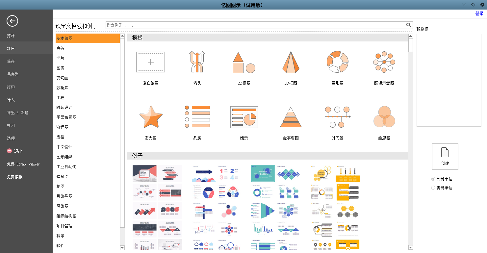

# [Docker][Ubuntu]Edraw安装

想要尝试在`Docker`容器上安装[Edraw](https://www.edrawsoft.cn/lp/edraw.html?renqun_youhua=1877794)，一不留神就花了一天时间，最后还有一个问题没有解决

## Dockerfile

```
FROM zjzstu/ubuntu:18.04
LABEL maintainer "zhujian <zjzstu@github.com>"

WORKDIR /app
RUN set -eux && \
	apt-get update && \
	apt-get install -y wget gosu && \
	gosu nobody true && \
    apt-get install -y libglib2.0-dev libgl1 libnvidia-gl-435 libxcb-render-util0 libdbus-1-3 libxrender1 libfontconfig1 libxi6 && \
    wget https://www.edrawsoft.cn/2download/edrawmax-9-amd64-cn.deb && \
    useradd -s /bin/bash -m user && \
    chown -R user:use[Ubuntu]nvidia-docker安装r /app && \
    dpkg -i *.deb && \
    rm -f *.deb && \
    apt-get autoclean -y && apt-get clean -y && \
	find /var/lib/apt/lists -type f -delete && \
	find /var/cache -type f -delete && \
	find /var/log -type f -delete && \
	find /usr/share/doc -type f -delete && \
	find /usr/share/man -type f -delete

COPY docker-entrypoint.sh ./
RUN chmod a+x docker-entrypoint.sh && \
	chown user:user docker-entrypoint.sh
ENTRYPOINT ["/app/docker-entrypoint.sh"]
```

## 启动项

创建`docker-entrypoint.sh`，创建普通用户`user`，切换到`user`后执行

```
#!/bin/bash

if [ "$(id -u)" -eq '0' ]
then
    USER_ID=${LOCAL_USER_ID:-9001}
 
    chown -R ${USER_ID} /app
    usermod -u ${USER_ID} user
    usermod -a -G root user
 
    export HOME=/home/user
    exec gosu user "$0" "$@"
fi

exec "$@"
```

## 启动命令

启动命令如下：

```
$ docker run \
     --rm -it \
      -v /tmp/.X11-unix:/tmp/.X11-unix \
      -e DISPLAY=unix$DISPLAY  \
      --privileged \
      -e XMODIFIERS="@im=fcitx" \
      -e QT_IM_MODULE="fcitx" \
      -e GTK_IM_MODULE="fcitx" \
      -e GID=`id -g` \
      -e UID=`id -u` \
      --name edrawmax \
      --gpus all \
      -d \
      zjzstu/edrawmax:latest \
      edrawmax
```



## 问题一：libGL error: No matching fbConfigs or visuals found libGL error: failed to load driver: swrast

启动应用后，输出如下错误

```
libGL error: No matching fbConfigs or visuals found 
libGL error: failed to load driver: swrast
```

参考[libGL error: No matching fbConfigs or visuals found libGL error: failed to load driver: swrast #253](https://github.com/jessfraz/dockerfiles/issues/253)，是关于显卡驱动的问题

在主机安装`Nvidia`容器工具包（参考[[Ubuntu]nvidia-docker安装](../advanced/[Ubuntu]nvidia-docker安装.md)），然后在容器安装`libnvidia-gl-xxx`即可

## 问题二：应用无法输入中文

这个问题找了很久也没有解决，在终端上可以输入和显示中文，在应用上也可以显示中文，但是无法设置中文输入法