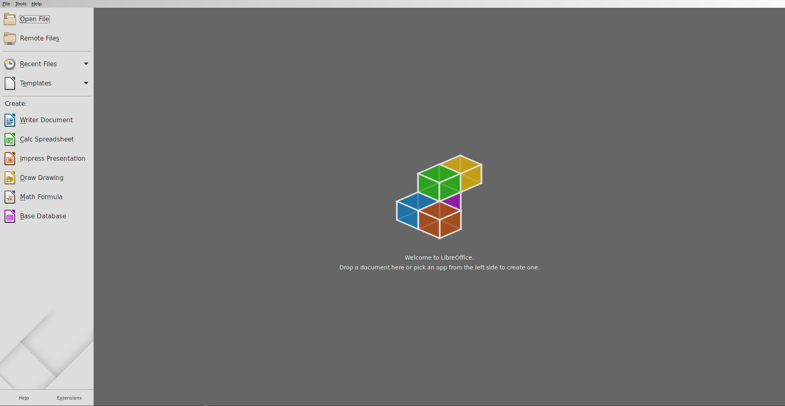

# [Docker][Ubuntu]Libreoffice运行

参考：[【微信分享】林帆：Docker运行GUI软件的方法](https://www.csdn.net/article/2015-07-30/2825340)

利用`Docker`容器可视化运行`Libreoffice`

## 构建

下载[libreoffice/Dockerfile](https://github.com/jessfraz/dockerfiles/blob/master/libreoffice/Dockerfile)

```
FROM alpine:latest
LABEL maintainer "Jessie Frazelle <jess@linux.com>"

RUN apk --no-cache add \
	--repository http://dl-cdn.alpinelinux.org/alpine/edge/testing \
	libreoffice \
	ttf-dejavu

ENTRYPOINT [ "libreoffice" ]
```

执行构建命令

```
$ docker build -t jess/libreoffice .
```

生成镜像`jess/libreoffice`

## 配置

使用`xhost`命令允许所有用户访问`X11`服务

```
$ sudo apt-get install x11-xserver-utils
$ xhost +
```

## 运行

```
docker run -d \
    -v /etc/localtime:/etc/localtime:ro \
    -v /tmp/.X11-unix:/tmp/.X11-unix \
    -e DISPLAY=unix$DISPLAY \
    -v $HOME/slides:/root/slides \
    -e GDK_SCALE \
    -e GDK_DPI_SCALE \
    --name libreoffice \
    jess/libreoffice
```

即可启动`libreoffice`，其操作文件可放置于`$HOME/slides`文件夹



关闭`libreoffice`后可再次重新启动：

```
$ docker ps -a
CONTAINER ID        IMAGE               COMMAND             CREATED             STATUS                     PORTS               NAMES
9ea0bd8bd9f9        jess/libreoffice    "libreoffice"       57 seconds ago      Exited (0) 6 seconds ago                       libreoffice
$ docker start 9ea0
9ea0
```