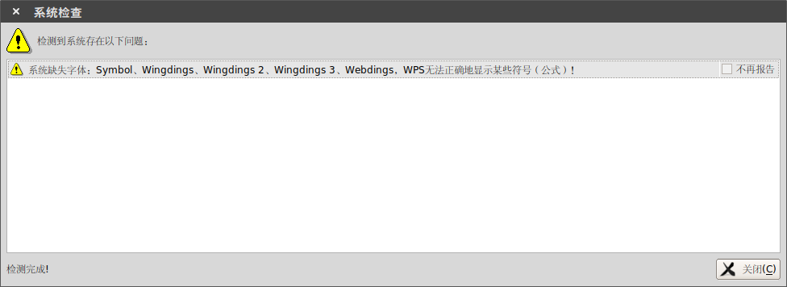
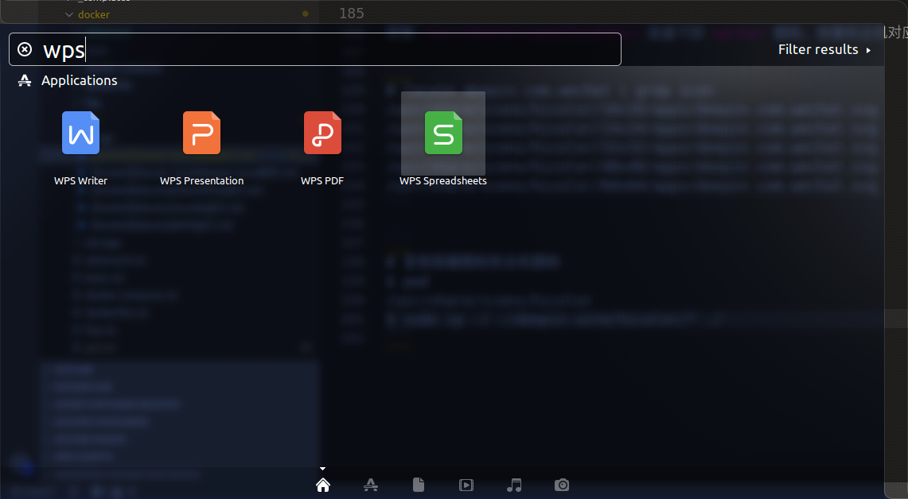
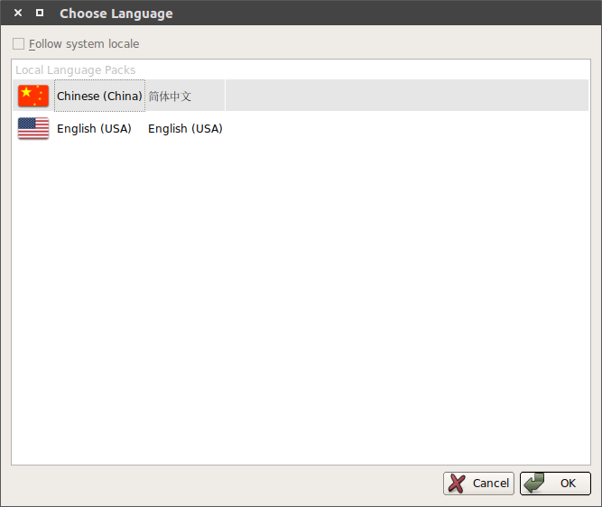
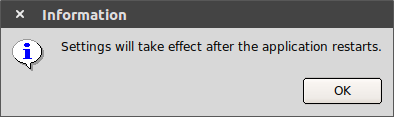
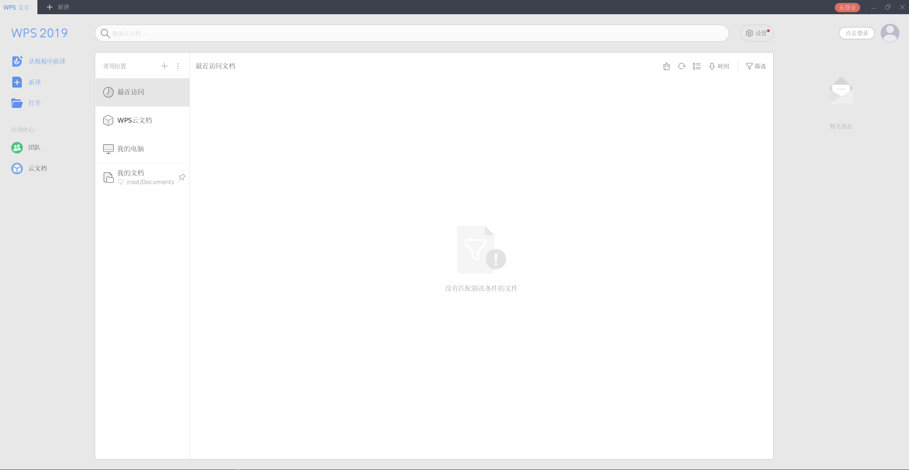

# [Docker][Ubuntu]WPS运行

参考：

[WPS Office (简体中文)](https://wiki.archlinux.org/index.php/WPS_Office_(简体中文))

`Ubuntu`自带的`Libreoffice`操作体验不如`word`，打算安装`WPS For Linux`

官网地址：[WPS](https://linux.wps.cn/#)

共`4`项功能：

1. `wps for word`
2. `wps for ppt`
3. `wps for excel`
4. `wps for pdf`

完整脚本地址：[Containerization-Automation/dockerfiles/wps](https://github.com/zjZSTU/Containerization-Automation/tree/master/dockerfiles/wps)

`Docker Hub`地址：[zjzstu/wps](https://cloud.docker.com/u/zjzstu/repository/docker/zjzstu/wps)

## Windows字体

参考：

[在ubuntu中安装中文字体](https://blog.csdn.net/zapperstab/article/details/18602969)

[在CentOS中安装中文字体](https://javawind.net/p130)

`Linux`版`WPS`缺少一些`Windows`字体，其在安装启动后会提示



参考[linux下wps，系统缺失字体：wingdings、wingdings 2、wingdings3](https://www.cnblogs.com/xueranzp/p/5703791.html)下载[字体](https://download.csdn.net/download/wl1524520/6333049)

## 无法输入中文

参考：

[关于Ubuntu16.04中WPS不能输入中文的问题](https://blog.csdn.net/wangdong2017/article/details/83928729)

[在Linux Mint 19上安装中文输入法](http://leetschau.github.io/zai-linux-mint-19shang-an-zhuang-zhong-wen-shu-ru-fa.html)

设置环境变量

```
export XMODIFIERS="@im=fcitx"
export QT_IM_MODULE="fcitx"
export GTK_IM_MODULE="fcitx"
```

## 编辑

完整`Dockerfile`如下：

```
FROM zjzstu/ubuntu:latest
LABEL maintainer "zhujian <zjzstu@github.com>"

WORKDIR /app
COPY wps_symbol_fonts.zip ./

RUN set -eux && \
	# 安装wps依赖，安装额外工具xdg-utils/unzip/wget/gosu
	apt-get update && \
	apt-get install -y libfreetype6 libcups2 libglib2.0-0 libglu1-mesa libsm6 libxrender1 libfontconfig1 libxext6 libxcb1 libgtk2.0-0 libcanberra-gtk-module xdg-utils unzip wget gosu && \
	# verify that the binary works
	gosu nobody true && \
	# 下载安装包
	wget http://kdl.cc.ksosoft.com/wps-community/download/8865/wps-office_11.1.0.8865_amd64.deb && \
	wget http://kdl.cc.ksosoft.com/wps-community/download/fonts/wps-office-fonts_1.0_all.deb && \
	# 新建用户user，并修改安装包属主/属组
	useradd -s /bin/bash -m user && \
	chown user:user wps*.deb && \
	# 安装wps及中文字体
	unzip wps_symbol_fonts.zip -d /usr/share/fonts/ && \
	chmod 755 /usr/share/fonts/*.ttf && \
	chmod 755 /usr/share/fonts/*.TTF && \
	dpkg -i wps-office_11.1.0.8865_amd64.deb && \
	dpkg -i wps-office-fonts_1.0_all.deb && \
	# 删除
	rm *.deb wps_symbol_fonts.zip && \
	apt-get remove -y --purge wget unzip && \
	apt-get autoremove -y --purge && apt-get autoclean -y && apt-get clean -y && \
	find /var/lib/apt/lists -type f -delete && \
	find /var/cache -type f -delete && \
	find /var/log -type f -delete && \
	find /usr/share/doc -type f -delete && \
	find /usr/share/man -type f -delete

COPY docker-entrypoint.sh ./
# 赋予docker-entrypoint.sh可执行权限
RUN chmod a+x docker-entrypoint.sh

ENTRYPOINT ["/app/docker-entrypoint.sh"]
```

1. 设置工作目录`/app`
2. 将本地上下文的`wps_symbol_fonts.zip`复制到`/app`
3. 将所有安装操作组合在一起执行，有助于减少镜像大小
	* 下载`wps`相关依赖和工具，`wps`安装包
	* 新建用户`user`，修改`wps`安装包属主/属组
	* 添加`wps`中文字体并安装`wps`
	* 删除不再需要的资源
4. 复制`docker-entrypoint.sh`，赋予可执行权限并设置脚本为启动项

脚本`docker-entrypoint.sh`内容如下：

```
#!/bin/bash

if [ "$(id -u)" -eq '0' ]
then
    USER_ID=${LOCAL_USER_ID:-9001}
 
    chown -R ${USER_ID} /app
    usermod -u ${USER_ID} user
    usermod -a -G root user
 
    export HOME=/home/user
    exec gosu user "$0" "$@"
fi

exec "$@"
```

1. 切换到`user`用户，利用工具`gosu`进行切换，再次执行文件
2. 设置用户`user`的`ID`号和本地用户`ID`一致，保证绑定挂载时得到的文件能够相互使用

## 构建

```
$ docker build -t zjzstu/wps:latest .
```

最后得到镜像`zjzstu/wps:latest`

```
$ docker image ls
REPOSITORY          TAG                 IMAGE ID            CREATED             SIZE
zjzstu/wps          latest              f3e0e8b4b574        About an hour ago   1.5GB
```

## 运行

编写脚本`wps.sh`，可输入文件地址作为参数

```
#!/bin/bash

FINALNAME=
BASENAME="/home/user/Documents"

COMMAND="wps"
COMMAND_NAME="wps"
IMAGE_NAME="zjzstu/wps:latest"

# 替换主机文件路径为容器路径
function parse_arg()
{
    FILE_DIR=$1

    if [[ ${FILE_DIR} == ./* ]]
    then
        FINALNAME=${PWD}${FILE_DIR#.}
    elif [[ ${FILE_DIR} == ../* ]]
    then
        FINALNAME=`dirname ${PWD}`${FILE_DIR#..}
    elif [[ ${FILE_DIR} == ${HOME}* ]]
    then
        FINALNAME=${FILE_DIR}    
    else
        FINALNAME=${PWD}/${FILE_DIR}
    fi

    FINALNAME=${BASENAME}${FINALNAME#${HOME}}
}

# 启动wps镜像
function startup()
{
    docker run -d \
        -v /tmp/.X11-unix:/tmp/.X11-unix \
        -e DISPLAY=unix${DISPLAY} \
        -e LOCAL_USER_ID=`id -u ${USER}` \
        -e XMODIFIERS="@im=fcitx" \
        -e QT_IM_MODULE="fcitx" \
        -e GTK_IM_MODULE="fcitx" \
        -v ${HOME}:${BASENAME} \
        --name ${COMMAND_NAME} \
        ${IMAGE_NAME} \
        ${COMMAND} ${FINALNAME} > /dev/null 2>&1
}

function run()
{
    xhost + > /dev/null 2>&1

    START=$(docker ps -q --filter="name=${COMMAND_NAME}")
    STOP=$(docker ps -aq --filter="name=${COMMAND_NAME}")

    if [ -n "${START}" ]
    then
        docker exec -u user $START ${COMMAND} $FINALNAME > /dev/null 2>&1
    elif [ -n "${STOP}" ]
    then
        if [ -z ${FINALNAME} ]
        then
            docker restart ${STOP} > /dev/null 2>&1
        else
            docker container rm ${STOP} > /dev/null 2>&1
            startup
        fi
    else
        startup
    fi
}

function main()
{
    NUM=$#
    if [ $NUM -eq 1 ]
    then
    	parse_arg "$@"
    fi

	run "$@"
	exit 0
}

main "$@"
```

可将脚本置于主机`/usr/local/bin`目录下，这样就可以随时启动`wps`了

*`wpp.sh`、`et.sh`和`pdf.sh`脚本类似*

## 启动器设置

`wps`安装时已生成启动器文件，进入容器`/usr/share/applications`，将`wps-office-wps.desktop`、`wps-office-wpp.desktop`、`wps-office-et.desktop`和`wps-office-pdf.desktop`复制到挂载点

```
$ docker exec -it 3657 bash
root@3657ae2d42fb:/app# cd /usr/share/applications/
root@3657ae2d42fb:/usr/share/applications# ls
appurl.desktop  mimeapps.list  wps-office-et.desktop  wps-office-pdf.desktop  wps-office-wpp.desktop  wps-office-wps.desktop
```

同时复制图标文件夹`/usr/share/icons/hicolors`到挂载点

启动器`wps-office-wps.desktop`内容如下：

```
[Desktop Entry]
Comment=Use WPS Writer to edit articles and reports.
Comment[zh_CN]=使用 WPS 文字编写报告，排版文章
Exec=/usr/local/bin/wps %f
GenericName=WPS Writer
GenericName[zh_CN]=WPS 文字
MimeType=application/wps-office.wps;application/wps-office.wpt;application/wps-office.wpso;application/wps-office.wpss;application/wps-office.doc;application/wps-office.dot;application/vnd.ms-word;application/msword;application/x-msword;application/msword-template;application/wps-office.docx;application/wps-office.dotx;application/rtf;application/vnd.ms-word.document.macroEnabled.12;application/vnd.openxmlformats-officedocument.wordprocessingml.document
Name=WPS Writer
Name[zh_CN]=WPS 文字
StartupNotify=false
Terminal=false
Type=Application
Categories=Office;WordProcessor;Qt;
X-DBUS-ServiceName=
X-DBUS-StartupType=
X-KDE-SubstituteUID=false
X-KDE-Username=
Icon=wps-office2019-wpsmain
InitialPreference=3
StartupWMClass=wps
```

关键参数是

```
Exec=/usr/local/bin/wps %f
...
Icon=wps-office2019-wpsmain
```

主机从挂载点获取启动器文件和图标文件后，放置回`/usr/share/applications`和`/user/share/icons`目录下

并修改`wps`执行文件地址

```
Exec=/usr/local/bin/wps %f
```

这样就能在搜索栏中得到`wps`启动器了



*如果菜单栏一直不显示图标，试一下重启系统*

## 中文设置

参考：[linux wps英文版 如何改为中文版](https://blog.csdn.net/kinggang2017/article/details/89600217)

`WPS For Linux`默认是英文版，可设置为中文版本，打开一个文档，点击右上角的`A`符号


选择简体中文并确认





重新启动`wps`即可切换到中文版



## 小结

上述操作完成后，将`wps/wpp/et/wpspdf`作为`word`文档，`PPT`，表格和`pdf`的默认启动项，即可实现点击文档打开操作

卸载`libreoffice`命令

```
$ sudo apt-get remove --purge libreoffice-common
```