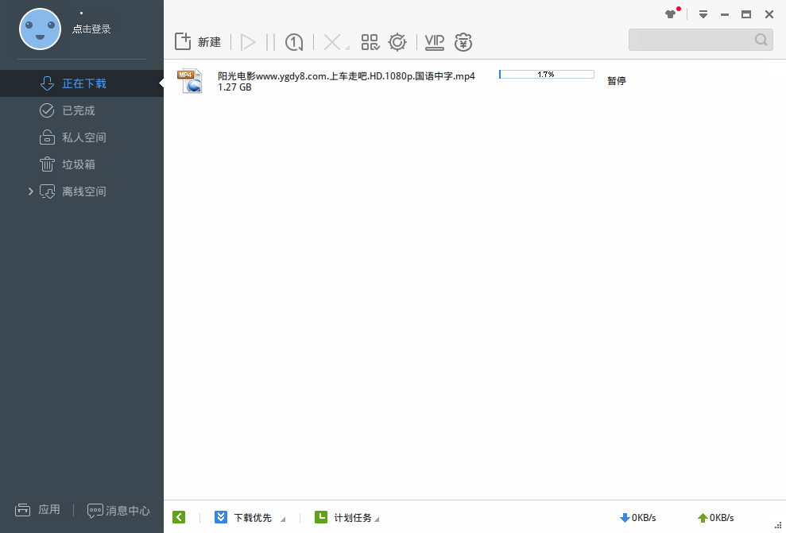

# [Docker][deepin-wine]迅雷运行

参考：[[Docker][deepin-wine]微信运行](https://container-automation.readthedocs.io/zh_CN/latest/docker/gui/[Docker][deepin-wine]微信运行.html)

迅雷安装包下载地址：[deepin.com.thunderspeed](https://mirrors.aliyun.com/deepin/pool/non-free/d/deepin.com.thunderspeed/)

完整脚本地址：[thunder](https://github.com/zjZSTU/Containerization-Automation/tree/master/dockerfiles/thunder)

迅雷下载地址中`Z`盘表示容器路径，默认下载在`Z:\迅雷下载`，等同于容器的`/迅雷下载`

当前脚本`thunder.sh`中挂载目录为`/home/user/ThunderSpeed Files`

