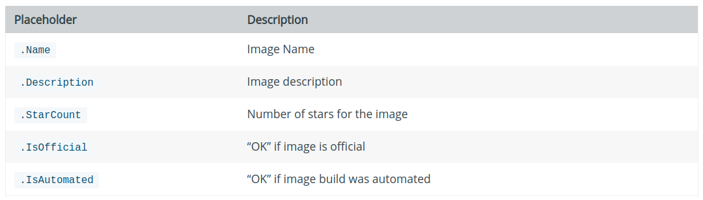

# [docker search]搜索镜像

参考：[docker search](https://docs.docker.com/engine/reference/commandline/search/)

`Docker`提供了命令`docker search`来搜索`Docker Hub`镜像

## 语法

```
docker search [OPTIONS] TERM
```

参数有以下4种：

1. `--limit`：搜索数量，默认`25`
2. `--no-trunc`：不截断输出
3. `--filter/-f`：基于给定条件过滤输出
4. `--format`：基于`GO`模板输出

## limit

默认打印`25`条搜索结果，可随机调整：

```
$ docker search --limit=3 hello-world
NAME                                    DESCRIPTION                                     STARS               OFFICIAL            AUTOMATED
hello-world                             Hello World! (an example of minimal Dockeriz…   1030                [OK]                
tutum/hello-world                       Image to test docker deployments. Has Apache…   63                                      [OK]
ansibleplaybookbundle/hello-world-apb   An APB which deploys a sample Hello World! a…   0                                       [OK]
```

## no-trunc

如果描述过长，默认会截断输出，可调整：

```
$ docker search --limit=3 --no-trunc hello-world
NAME                                    DESCRIPTION                                                                                    STARS               OFFICIAL            AUTOMATED
hello-world                             Hello World! (an example of minimal Dockerization)                                             1030                [OK]                
tutum/hello-world                       Image to test docker deployments. Has Apache with a 'Hello World' page listening in port 80.   63                                      [OK]
ansibleplaybookbundle/hello-world-apb   An APB which deploys a sample Hello World! app                                                 0                                       [OK]
```

## filter

按给定条件过滤搜索结果，当前有`3`种过滤选择：

1. 星数：`starts=3`
2. 是否自动构建：`is-automated=true/false`
3. 是否官方：`is-official=true/false`

这些过滤条件可一起使用

```
$ docker search --limit=3 --filter stars=3 --filter is-automated=false --filter is-official=true ubuntu 
NAME                 DESCRIPTION                                     STARS               OFFICIAL            AUTOMATED
ubuntu               Ubuntu is a Debian-based Linux operating sys…   9965                [OK]                
ubuntu-upstart       Upstart is an event-based replacement for th…   99                  [OK]                
ubuntu-debootstrap   debootstrap --variant=minbase --components=m…   40                  [OK] 
```

## format

按照`GO`模板指定格式输出，有以下占位符：



* `.Name`：镜像名
* `.Description`：镜像描述
* `.StarCount`：星数
* `.IsOfficial`：如果镜像是官方的，输出`OK`
* `.IsAutomated`：如果镜像是自动生成的，输出`OK`

下面仅输出镜像名和是否官方：

```
$ docker search --limit=3 --format "{{.Name}}: {{.IsOfficial}}" hello-world
hello-world: [OK]
tutum/hello-world: 
ansibleplaybookbundle/hello-world-apb:
```

如果模板中添加指令`table`，会添加列标题

```
$ docker search --limit=3 --format "table {{.Name}}\t{{.IsOfficial}}" hello-world
NAME                                    OFFICIAL
hello-world                             [OK]
tutum/hello-world                       
ansibleplaybookbundle/hello-world-apb   
```