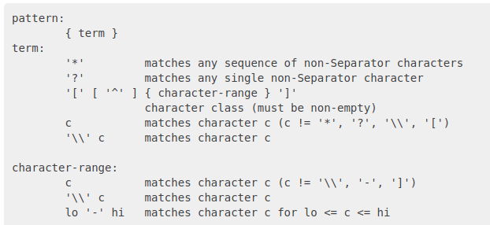

# 编写.dockerignore

参考：[.dockerignore file](https://docs.docker.com/engine/reference/builder/#dockerignore-file)

`.dockerignore`的作用和`.gitignore`类似，用于忽略或指定哪些文件不被`ADD`或`COPY`指令操作

## 匹配规则

其文件匹配规则遵循[Go's func Match](https://golang.org/pkg/path/filepath/#Match)



其中通配符有星号、问号以及中括号

* 星号（`*`）表示匹配任何非分隔字符序列
* 问号（`?`）表示匹配任何单个非分隔符字符
* 中括号（`[`）表示匹配位于字符范围内的字符

`Docker`还提供了一个特殊的通配符字符串`**`，用于匹配任何路径。比如`**/*.go`将匹配所有目录中以`.go`结尾的所有文件，包括生成上下文的根目录

以`#`开头的行被视为注释，不起作用

以`!`开头的匹配字符串表示指定匹配文件不被忽略

## 示例一

`.dockerignore`文件内容如下：

```
# comment
*/temp*
*/*/temp*
temp?
```

* 第一行是注释
* 第二行表示忽略所有二级目录中以`temp`开头的文件
* 第三行表示忽略所有三级目录中以`temp`开头的文件
* 第四行表示忽略根目录中以`temp`开头，后跟一个字符的文件

## 示例二

使用感叹号`!`指定匹配文件不被忽略，还需要考虑其在`.dockerignore`文件中的使用位置

```
*.md
!README.md
```

除了`README.md`外的所有`.md`文件都被忽略

```
*.md
!README*.md
README-secret.md
```

此时`README-secret.md`同样会被忽略

```
*.md
README-secret.md
!README*.md
```

此时`README-secret.md`同样不会被忽略

## 示例三

可以通过`.dockerignore`文件中忽略`Dockerfile`和`.dockerignore`文件。这些文件仍然被发送到守护进程，因为需要它们来完成工作。但是`ADD`和`COPY`指令不会将它们复制到镜像中