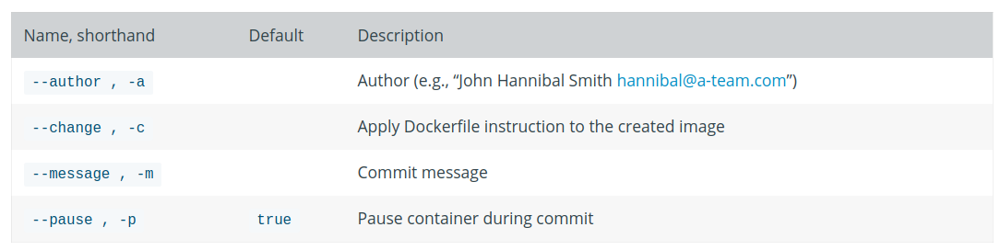

# [docker commit]保存容器为镜像

保存已修改后的容器为新的镜像

## 语法

```
docker commit [OPTIONS] CONTAINER [REPOSITORY[:TAG]]
```

* 参数`CONTAINER`指定容器`ID`
* 参数`REPOSITORY`指定新的镜像名，格式为
* 参数`TAG`指定额外标记，比如版本号

可添加额外选项，指定作者名，提交信息，是否在提交时暂停容器以及是否应用`Dockerfile`指令到创建的镜像



## 示例

```
$ docker commit --author zjzstu --message "using aliyun mirrors" f8f8 zjzstu/ubuntu:18.04
sha256:5493327e7708602f5ebb0b42d638234bf47ff4ee23804d3b3a96535d4c8dcec3

$ docker image ls
REPOSITORY          TAG                 IMAGE ID            CREATED             SIZE
zjzstu/ubuntu       18.04               5493327e7708        19 seconds ago      109MB
```