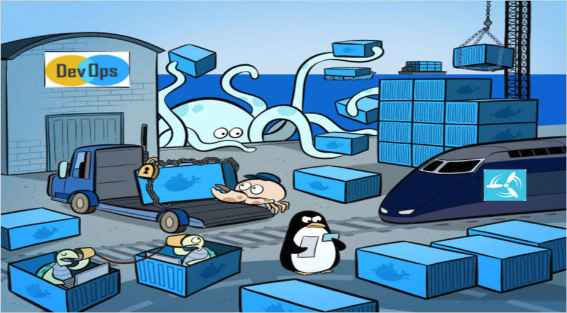

# 关于docker

参考：[Get Started, Part 1: Orientation and setup](https://docs.docker.com/get-started/)

理解`docker`工具以及容器、镜像等重要组成的概念

## Docker概念

`Docker`是开发人员和系统管理员使用容器开发、部署和运行应用程序的平台。使用`Linux`容器部署应用程序称为容器化（`containerization`）

容器化有以下优点：

1. 灵活性（`flexible`）：即使最复杂的应用也可以被容器化
2. 轻量级（`lightweight`）：容器之间相互作用并共享主机内核
3. 可互换性（`interchangeable`）：您可以动态部署更新和升级
4. 可移植性（`portable`）：本地构建，云端部署，任意运行
5. 可伸缩性（`scalable`）：可以增加并自动分发容器副本
6. 可堆叠（`stackable`）：可以垂直和动态堆叠服务



## 镜像和容器

容器（`container`）通过运行镜像（`image`）来启动：

* 镜像是一个可执行包，包含运行应用程序所需的所有内容 - 代码、运行时、库、环境变量和配置文件
* 容器是一个镜像的运行时实例 - 映像在执行时在内存中的内容（即，具有状态的映像或用户进程）。可以使用命令`docker ps`查看正在运行的容器列表

## 容器和虚拟机

* 容器在`Linux`上本地运行，与其他容器共享主机内核。它运行一个离散进程，占用的内存不比任何其他可执行文件多，因此它是轻量级
* 虚拟机（`virtual machine, VM`）运行一个完整的`客户端`操作系统，通过虚拟机监控程序对主机资源进行虚拟访问。一般来说，`VM`资源比大多数应用程序需要的资源多


## 容器和CI/CD

`docker`容器化的实现使得`CI/CD`可以无缝接轨：

* 应用程序没有系统依赖
* 可以将更新推送到分布式应用程序的任何部分
* 可以优化资源密度

## 常用命令

```
## List Docker CLI commands
docker
docker container --help

## Display Docker version and info
docker --version
docker version
docker info

## Execute Docker image
docker run hello-world

## List Docker images
docker image ls

## List Docker containers (running, all, all in quiet mode)
docker container ls
docker container ls --all
docker container ls -aq
```