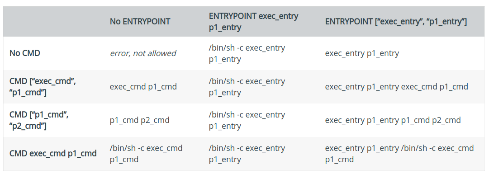

# ENTRYPOINT

参考：[ENTRYPOINT](https://docs.docker.com/engine/reference/builder/#entrypoint)

`EXTRYPOING`指令指定容器启动后运行的可执行文件

## 语法

有`2`种书写格式：

1. `ENTRYPOINT ["executable", "param1", "param2"]`（`exec`形式，推荐）
2. `ENTRYPOINT command param1 param2`（`shell`形式）

可以在使用`docker run`命令启动容器时添加`executable`参数，

* 对于`exec`形式的`ENTRYPOINT`指令
    * 命令行参数将添加到`exec`表达式的参数之后，同时重写`CMD`指令指定的参数。比如执行`docker run <image> -d`，则`-d`将会作为入口点的参数
    * 可以使用标识符`--entrypoint`重写`ENTRYPOINT`指令
* 对于`shell`形式的`ENTRYPOINT`指令，不会使用`CMD`或`docker run`添加的参数

`Dockerfile`文件中只有最后一条`ENTRYPOINT`指令其作用

## Exec形式示例

```
FROM zjzstu/ubuntu:18.04
ENTRYPOINT ["top", "-b"]
CMD ["-c"]
```

完整的入口点命令为`top -b -c`。启动该容器后，仅有该应用运行

启动容器如下：

```
# 镜像名为top:v4
$ docker run -it --rm --name test top:v4
top - 06:01:45 up  4:26,  0 users,  load average: 0.20, 0.38, 0.37
Tasks:   1 total,   1 running,   0 sleeping,   0 stopped,   0 zombie
%Cpu(s):  1.7 us,  0.5 sy,  0.0 ni, 97.6 id,  0.1 wa,  0.0 hi,  0.1 si,  0.0 st
KiB Mem : 16164188 total,  8438760 free,  3265344 used,  4460084 buff/cache
KiB Swap: 15999996 total, 15999996 free,        0 used. 11943604 avail Mem 

  PID USER      PR  NI    VIRT    RES    SHR S  %CPU %MEM     TIME+ COMMAND
    1 root      20   0   36484   3036   2688 R   0.0  0.0   0:00.21 top
```

也可通过`docker exec`验证

```
$ docker exec fde5 ps aux
USER       PID %CPU %MEM    VSZ   RSS TTY      STAT START   TIME COMMAND
root         1  0.4  0.0  36484  3020 pts/0    Ss+  06:05   0:00 top -b
root        11  0.0  0.0  34400  2860 ?        Rs   06:06   0:00 ps aux
```

**注意 1：`exec`形式作为`JSON`数组，使用双引号而不是单引号**

**注意 2：`exec`形式不会调用命令行`shell`，所以如果要进行`shell`处理必须显式调用`/bin/sh -c`，比如`ENTRYPOING ["sh", "-c", "echo $HOME"]`**

## Shell形式示例

`shell`形式的缺点在于其作为`/bin/sh -c`的子命令，不会输入信号。这意味着可执行文件不是容器的`PID 1`，不会接收到`Unix`信号，所以可执行文件无法接受来自`docker stop <container>`的`SIGTERM`信号。此时运行`docker stop`，容器不会干净地退出，`stop`命令将在超时后强制发送`SIGKILL`指令

可以指定`exec`启动命令，这样就能得到`PID 1`的入口程序

```
FROM zjzstu/ubuntu:18.04
ENTRYPOINT exec top -b
```

创建镜像`top`并启动

```
$ docker run -t top .

$ docker run -it --rm --name test top
top - 06:17:18 up  4:41,  0 users,  load average: 0.43, 0.65, 0.54
Tasks:   1 total,   1 running,   0 sleeping,   0 stopped,   0 zombie
%Cpu(s):  1.8 us,  0.5 sy,  0.0 ni, 97.5 id,  0.1 wa,  0.0 hi,  0.1 si,  0.0 st
KiB Mem : 16164188 total,  8468692 free,  3225808 used,  4469688 buff/cache
KiB Swap: 15999996 total, 15999996 free,        0 used. 11979700 avail Mem 

  PID USER      PR  NI    VIRT    RES    SHR S  %CPU %MEM     TIME+ COMMAND
    1 root      20   0   36484   2956   2604 R   0.0  0.0   0:00.21 top
```

可使用`/usr/bin/time`测试`docker top`停止镜像的运行时间

对于镜像`top`，测试如下

```
$ docker ps
CONTAINER ID        IMAGE               COMMAND                  CREATED             STATUS              PORTS               NAMES
dc47139817b3        top                 "/bin/sh -c 'exec to…"   2 minutes ago       Up 2 minutes                            test
(base) zj@zj-ThinkPad-T470p:~$ /usr/bin/time docker stop dc47
dc47
0.01user 0.02system 0:00.52elapsed 7%CPU (0avgtext+0avgdata 63500maxresident)k
0inputs+0outputs (0major+7827minor)pagefaults 0swaps
```

对于不使用`exec`命令的`Shell`形式，测试如下：

```
$ /usr/bin/time docker stop f5fe
f5fe
0.01user 0.02system 0:10.68elapsed 0%CPU (0avgtext+0avgdata 62684maxresident)k
0inputs+0outputs (0major+7923minor)pagefaults 0swaps
```

前者花费了`0.52`秒，后者花费了`10.68`秒

## CMD和ENTRYPOINT的交互

`CMD`和`ENTRYPOINT`指令都定义了运行容器时执行的命令，其合作如下：

1. `Dockerfile`文件应该至少定义一条`CMD`或`ENTRYPOINT`指令
2. `ENTRYPOING`适用于将容器作为可执行文件的场景
3. `CMD`适用于定义`ENTRYPOINT`命令在容器中执行特殊命令的默认参数
4. 使用可选参数运行容器时，将重写`CMD`

**注意：如果`CMD`指令定义在基础镜像，那么`ENTRYPOINT`将会重置`CMD`为空。如果需要`CMD`指令操作，必须在当前镜像上重写**

