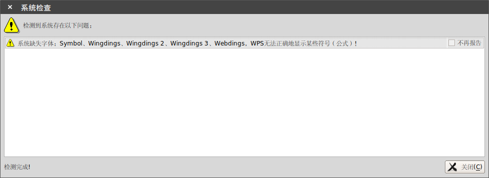
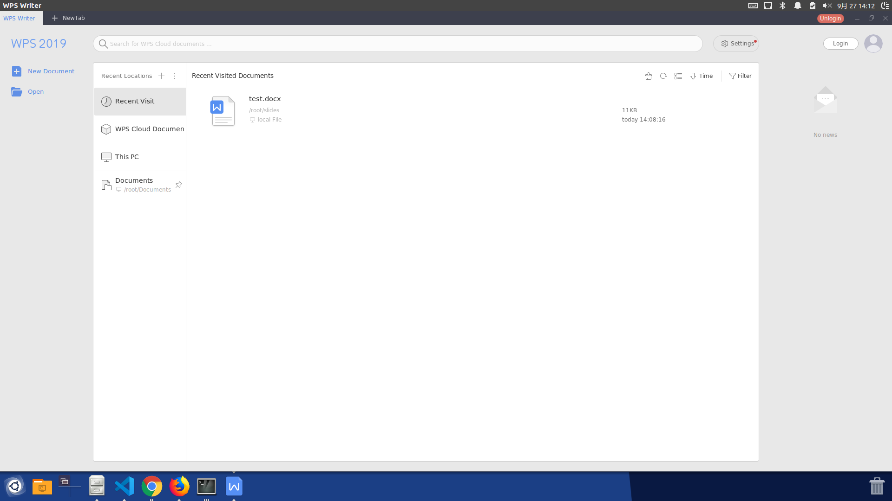
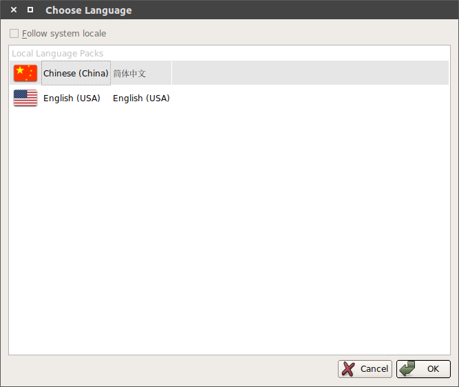
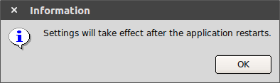
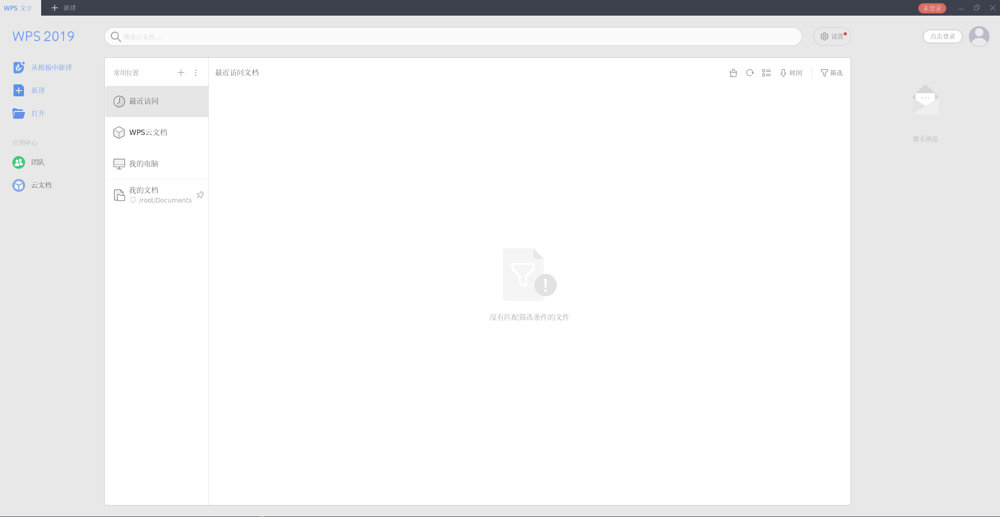

# [Docker][Ubuntu]WPS运行

`Ubuntu`自带的`Libreoffice`操作体验不如`word`，打算安装`WPS For Linux`

## 下载

### 安装包

从[官网](http://wps-community.org/downloads)下载`deb`安装包，包含`wps-office`安装包以及中文字体安装包

```
$ wget http://kdl.cc.ksosoft.com/wps-community/download/8865/wps-office_11.1.0.8865_amd64.deb
$ wget http://kdl.cc.ksosoft.com/wps-community/download/fonts/wps-office-fonts_1.0_all.deb
```

### Windows字体

参考：

[在ubuntu中安装中文字体](https://blog.csdn.net/zapperstab/article/details/18602969)

[在CentOS中安装中文字体](https://javawind.net/p130)

`Linux`版`WPS`缺少一些`Windows`字体，其在安装启动后会提示



参考[linux下wps，系统缺失字体：wingdings、wingdings 2、wingdings3](https://www.cnblogs.com/xueranzp/p/5703791.html)下载[字体](https://download.csdn.net/download/wl1524520/6333049)

### 路径

以上文件和`Dockerfile`放置在同一路径

```
$ ls
Dockerfile  wps-office_11.1.0.8865_amd64.deb  wps-office-fonts_1.0_all.deb  wps_symbol_fonts.zip
```

## Dockerfile

安装`wps`需要先安装依赖，还需要将`Windows`字体放置在指定位置，安装完成后还可以删除一些文件

```
FROM zjzstu/ubuntu:18.04
RUN apt-get update && apt-get install -f
RUN apt-get install -y libfreetype6 libcups2 libglib2.0-0 libglu1-mesa libsm6 libxrender1 libfontconfig1 libxext6 libxcb1
RUN apt-get install -y xdg-utils unzip

WORKDIR /app
COPY wps-office_11.1.0.8865_amd64.deb wps-office-fonts_1.0_all.deb wps_symbol_fonts.zip /app/
RUN unzip wps_symbol_fonts.zip -d /usr/share/fonts/ && \
	cd /usr/share/fonts/ && \
	chmod 755 *.ttf && \
	chmod 755 *.TTF
RUN dpkg -i wps-office_11.1.0.8865_amd64.deb && dpkg -i wps-office-fonts_1.0_all.deb

RUN rm wps-office_11.1.0.8865_amd64.deb wps-office-fonts_1.0_all.deb wps_symbol_fonts.zip
RUN apt-get autoremove -y --purge && apt-get autoclean -y && apt-get clean -y && \
	find /var/lib/apt/lists -type f -delete && \
	find /var/cache -type f -delete && \
	find /var/log -type f -delete && \
	find /usr/share/doc -type f -delete && \
	find /usr/share/man -type f -delete

ENTRYPOINT ["/usr/bin/wps"]
```

## 构建

```
$ docker build -t wps .
Sending build context to Docker daemon  325.7MB
...
...
Successfully built 129fe51c2632
Successfully tagged wps:latest
```

最后得到镜像`wps`

```
$ docker image ls
REPOSITORY          TAG                 IMAGE ID            CREATED             SIZE
wps                 latest              129fe51c2632        2 minutes ago       1.83GB
```

## 运行

启动`wps`

```
$ docker run -d -v /etc/localtime:/etc/localtime:ro \
    -v /tmp/.X11-unix:/tmp/.X11-unix \
    -e DISPLAY=unix$DISPLAY \
    -v $HOME/slides:/root/slides \
    -e GDK_SCALE \
    -e GDK_DPI_SCALE \
    --name wps \
    wps
```



## 中文设置

参考：[linux wps英文版 如何改为中文版](https://blog.csdn.net/kinggang2017/article/details/89600217)

`WPS For Linux`默认是英文版，可设置为中文版本，打开一个文档，点击右上角的`A`符号


选择简体中文并确认





关闭`wps`，重新启动容器即可切换到中文版

```
$ docker ps -a
CONTAINER ID        IMAGE               COMMAND             CREATED             STATUS                     PORTS               NAMES
0758b18ce2bc        wps                 "/usr/bin/wps"      5 minutes ago       Exited (0) 4 seconds ago                       wps
(base) zj@zj-ThinkPad-T470p:~/docker/wps$ docker container restart 0758
0758
```



将设置完成后的容器保存为镜像

```
$ docker commit --author zjzstu --message "wps for Linux" 6ec9 zjzstu/wps:v2
$ docker tag zjzstu/wps:v2 zjzstu/wps:latest
```