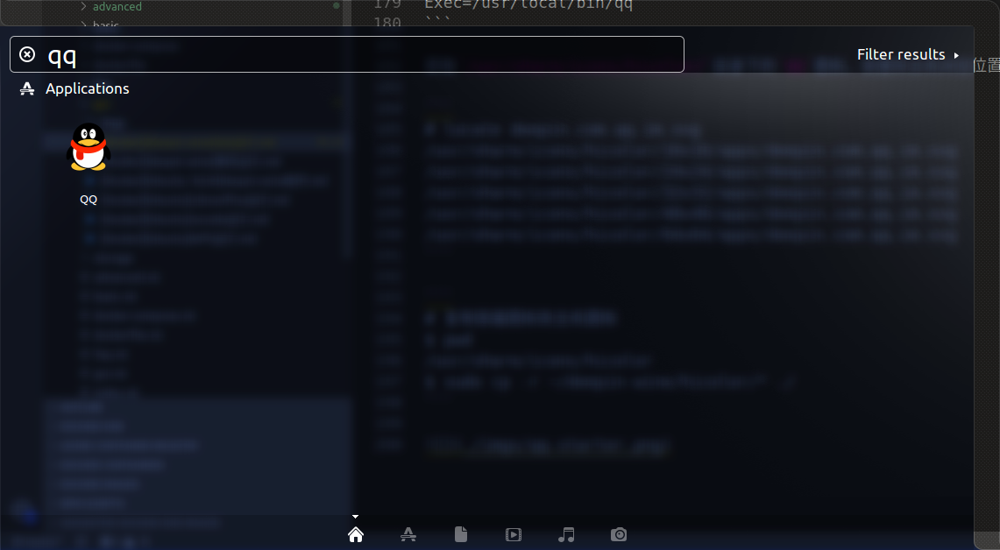

# [Docker][deepin-wine]QQ运行

通过`deepin-wine`在`Ubuntu 18.04`上运行`QQ`

安装包地址：[deepin.com.qq.im](https://mirrors.aliyun.com/deepin/pool/non-free/d/deepin.com.qq.im/)

完整脚本地址：[QQ](https://github.com/zjZSTU/Containerization-Automation/tree/master/dockerfiles/qq)

在`Docker Ubuntu 18.04`下安装`QQ`和安装`WeChat`类似，参考：[[Docker][deepin-wine]微信运行](https://container-automation.readthedocs.io/zh_CN/latest/docker/gui/[Docker][deepin-wine]微信运行.html)

## Ubuntu 18.04出错

之前在`Ubuntu 16.04`上运行没有问题，现在在`Ubuntu 18.04`上运行突然出错。制作了[[Docker][deepin-wine]TIM运行](https://container-automation.readthedocs.io/zh_CN/latest/docker/gui/[Docker][deepin-wine]TIM%E8%BF%90%E8%A1%8C.html)来替代使用

*目前QQ重新发布了[QQ for Linux](https://im.qq.com/download/)*
