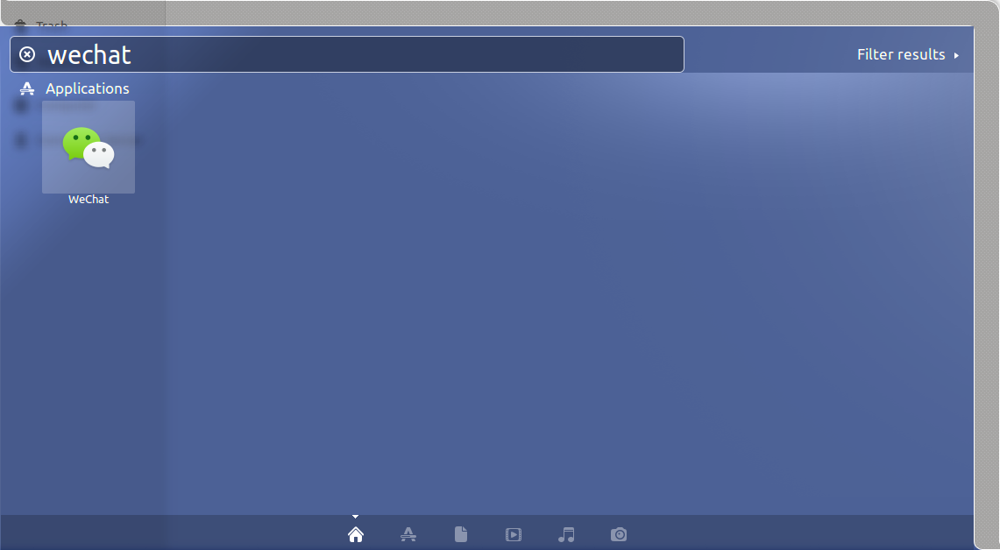

# [Docker][deepin-wine]微信运行

通过`deepin-wine`在`Ubuntu 18.04`上运行微信

微信安装包地址：[deepin.com.wechat](https://mirrors.aliyun.com/deepin/pool/non-free/d/deepin.com.wechat/)

完整脚本地址：[wechat](https://github.com/zjZSTU/Containerization-Automation/tree/master/dockerfiles/wechat)

## 安装

编写`Dockerfile`

1. 安装`wget ttf-wqy-microhei gosu dbus`
2. 创建普通用户`user`，下载微信安装包，修改属主并安装
3. 清理资源
4. 设置启动项`docker-entrypoint.sh`

*注意：不安装中文字体会导致微信中文乱码*

编写`docker-entrypoint.sh`

1. 获取主机传入的环境变量，包括用户`ID`，用户组`ID`，音频组`ID`，视频组`ID`，修改`user`属性
2. 切换普通用户`user`，启动微信

`deepin-wine`的微信出现的一个问题是第一次运行时会自动结束程序再启动，参考[bestwu/docker-wechat](https://github.com/bestwu/docker-wechat/blob/master/entrypoint.sh)，通过`sleep`功能保持容器运行

## 构建

```
$ docker build -t zjzstu/wechat:latest .
$ docker image ls
REPOSITORY           TAG                 IMAGE ID            CREATED             SIZE
zjzstu/wechat        latest              9d4352ba37fd        56 seconds ago      954MB
```

## 运行

参考：[Ubuntu下使用Tim/Wechat](https://www.gubeiqing.cn/2018/10/27/docker13/?utm_source=tuicool&utm_medium=referral#安装Docker)

* 将主机用户`ID`，用户组`ID`，音频组`ID`和视频组`ID`传入容器
* 挂载本地`deepin-wine`配置目录到容器
* 挂载本地`wechat`配置目录到容器

**注意：每次重新调用微信启动命令，都需要重新登录（好像是`deeping-wine`的设置），所以无法登录多组用户**

## 可执行脚本

在主机新建脚本`wechat.sh`，统一操作`wechat`的启动。根据`wechat`容器的状态分`3`种情况

* 没有`wechat`容器运行时执行新建容器操作
* 正在运行容器则使用`docker exec`命令进入容器启动微信程序
* 容器停止运行时执行重启容器操作

将其放置在`/usr/local/bin`目录下，即可在任何地方启动

## 菜单启动器

以`docker exec`方式进入容器

获取`/opt/deepinwine/apps/Deepin-WeChat`目录下的`deepin.com.wechat.desktop`文件，修改参数`Exec`，放置到主机`/usr/share/applications/`

```
Exec=/usr/local/bin/wechat
```

获取`/usr/share/icons/hicolor/`目录下的`wechat`图标，放置到主机对应位置

```
# locate deepin.com.wechat | grep icon
/usr/share/icons/hicolor/16x16/apps/deepin.com.wechat.svg
/usr/share/icons/hicolor/24x24/apps/deepin.com.wechat.svg
/usr/share/icons/hicolor/32x32/apps/deepin.com.wechat.svg
/usr/share/icons/hicolor/48x48/apps/deepin.com.wechat.svg
/usr/share/icons/hicolor/64x64/apps/deepin.com.wechat.svg
```

```
# 复制容器图标到主机图标
$ pwd
/usr/share/icons/hicolor
$ sudo cp -r ~/deepin-wine/hicolor/* ./
```

