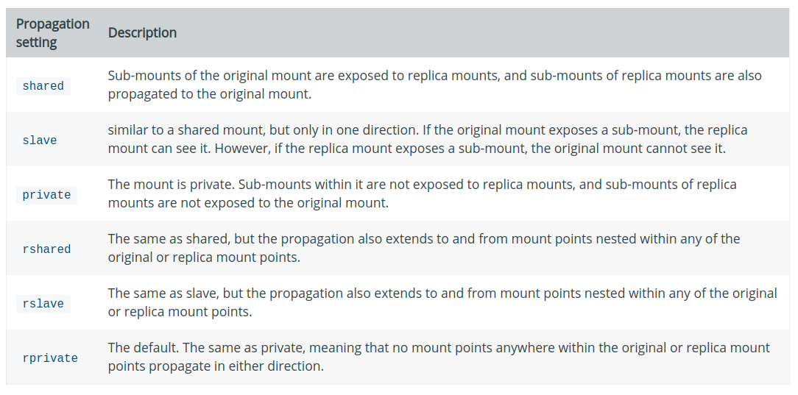

# [volume][bind mount]bind propagation设置

参考：[Use bind mounts](https://docs.docker.com/storage/bind-mounts/#configure-bind-propagation)

对于卷和绑定挂载而言，绑定传播（`bind propagation`）默认设置为`rprivate`。仅有`Linux`主机上的绑定挂载才能配置绑定传播

## 什么是绑定挂载

绑定传播是指在给定绑定挂载或命名卷中创建的挂载是否可以传播到该挂载的副本。考虑一个挂载点`/mnt`，同时挂载在`/tmp`上。绑定设置控制`/tmp/a`上的挂载是否也可以在`/mnt/a`上使用

每次传播设置都有一个递归对位（`recursive counterpoint`）。在递归的情况下，考虑`/tmp/a`也被挂载为`/foo`。传播设置控制是否存在`/mnt/a`和(或者)`/tmp/a`

## 选项



* `shared`：原始挂载的子挂载点能够传播到副本挂载，反之即可
* `slave`：类似于`share`，仅作用于一个方向。如果原始挂载新建了一个子文件，那么副本挂载可以查看，反之不行
* `private`：挂载是私有的。原始挂载的子挂载无法传播给副本挂载，反之也不可行
* `rshared`：作用和`shared`一样。传播功能扩展到任何嵌套的文件
* `rslave`：作用和`slave`一样。传播功能扩展到任何嵌套的文件
* `rprivate`：默认设置。作用和`private`一样。意味着没有挂载点可以在任一方向传播

## 示例

挂载主机的`target/`目录到容器的`/app`和`/app2`，设置第二个挂载点只读，同时设置绑定挂载设置为`rslave`

实现如下：

```
# 使用-v选项
$ docker run -d \
  -it \
  --name devtest \
  -v "$(pwd)"/target:/app \
  -v "$(pwd)"/target:/app2:ro,rslave \
  nginx:latest

# 使用--mount选项
$ docker run -d \
  -it \
  --name devtest \
  --mount type=bind,source="$(pwd)"/target,target=/app \
  --mount type=bind,source="$(pwd)"/target,target=/app2,readonly,bind-propagation=rslave \
  nginx:latest
```

当在`/app`中创建文件夹`foo`时，能够在`/app2`中出现